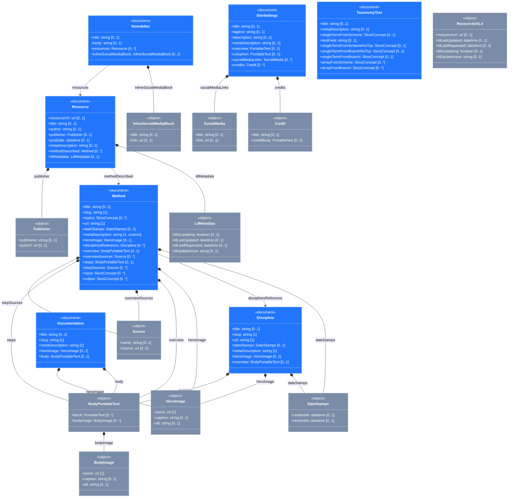

# Content model

> Auto-generated from the Sanity Studio schema. Do not edit by hand — re-run `pnpm --filter uxmethods-content-model generate` to refresh. See [ADR 0006](decisions/0006-content-model-mermaid-export.md) for the contract.

