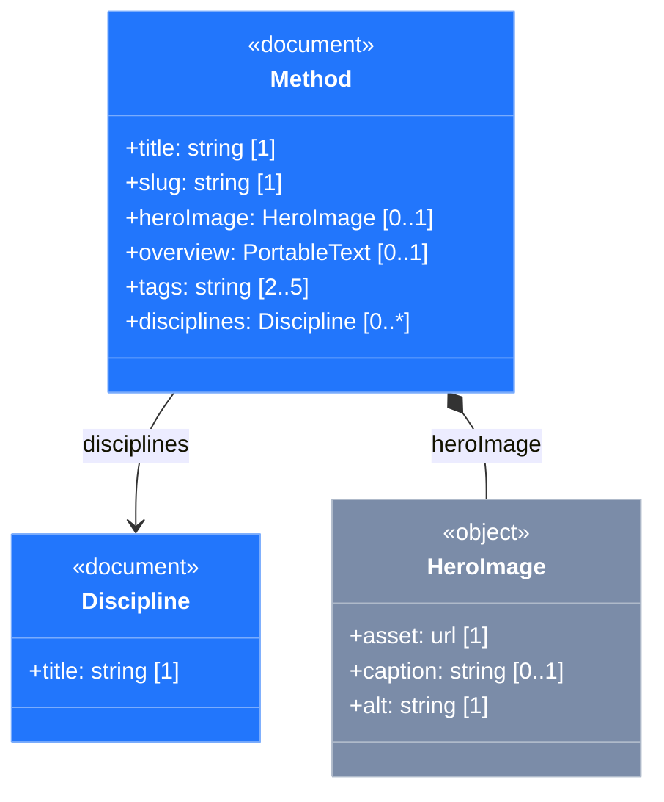

# 0006 — Content-model export as a Mermaid class diagram

**Status:** accepted

**Supersedes:** ADR 0005 — Content-model export from Sanity schemas (lives on branch [`archive/content-model-rdf`](https://github.com/) only; never merged to `main`).

## Context

The Sanity Studio schemas in `studio/schemaTypes/` define the structure of UX Methods content — document types, shared object types, fields, references. There is value in lifting that structure into a holistic, visual representation that:

- **Tracks schema drift over time** through the git history of a generated artefact.
- **Distinguishes documents from shared objects** — the entity-with-identity vs compositional-value-object distinction that Sanity actually models.
- **Shows references, composition, and field-level types with cardinality**.
- **Renders in tools already in our workflow** — GitHub markdown, [mermaid.live](https://mermaid.live), [mermaid.ai](https://mermaid.ai).

ADR 0005 attempted this as an OWL/RDFS export aimed at Protégé. In practice, RDFS makes everything an `owl:Class` and flattens the document/object distinction into a single class hierarchy. That is a paradigm mismatch with what the artefact is trying to communicate, not a tooling shortcoming — the RDF/OWL vocabulary genuinely does not have a first-class way to say "this kind of thing has its own identity and lives at a top-level URL; this other kind is always embedded in something else."

Mermaid's `classDiagram` syntax is purpose-built for exactly this structural-visualisation job. Stereotypes mark the document/object distinction, composition diamonds mark embedded objects, association arrows mark references, cardinality sits on the lines, and `classDef` styles each stereotype distinctly.

The RDF exploration is preserved on `archive/content-model-rdf` (including ADR 0005 itself); this ADR does not delete that work, it reframes the problem.

## Decision

Generate the content model as a Mermaid `classDiagram` and commit it to the repo.

### Output

- **File:** `docs/content-model.md` — committed, **not** gitignored. The drift-tracking story is the file's *git history*; that is the value here, distinct from how `graph/build/*` artefacts are treated.
- **Format:** a single fenced ```` ```mermaid ```` code block so the diagram renders inline on GitHub.

### Vocabulary mapping

- **Stereotypes and styling**
  - Document types: `<<document>>` annotation inside the class body, blue fill + stroke via `classDef document fill:#2276FC,stroke:#7AACFD,color:#fff`.
  - Object types: `<<object>>` annotation inside the class body, slate fill + stroke via `classDef object fill:#7B8CA8,stroke:#AFBACA,color:#fff`.
  - Styling is applied at class declaration with Mermaid's `:::` operator: `class Method:::document { ... }`. The annotation produces the visible `«document»` text label; the styleClass produces the colour. **Trap to avoid:** a standalone `class Name stereotype` line — without the `:::` — does *not* apply the classDef. Mermaid parses it as a new-class declaration with the concatenated name (`Methoddocument`), rendering an extra empty box. The emitter declares each class exactly once, with `:::stereotype` at the declaration site, and never emits separate style-assignment lines.
  - `classDef` declarations are emitted at the **end** of the diagram, after all class declarations and edges. Mermaid's parser tolerates either order via forward-reference resolution, but mermaidviewer.com empirically drops the fill colours when classDef precedes the classes that reference it. Bottom-placement renders consistently across mermaidviewer, mermaid.live, and GitHub markdown.
- **Fields and relationships**
  - Primitive field → `+fieldName: type [cardinality]` inside the class body.
  - Object field (named composition target or inline anonymous object) → field-line plus `Parent *-- Child` edge (composition; filled diamond).
  - Reference field → field-line plus `Parent --> Target` edge (association; arrow).
  - Portable Text → field-line type label only (`+overview: PortableText [0..1]`); no `PortableText` class, no edge.
  - Image-typed top-level objects → emitted as object-stereotype classes. A synthetic `+asset: url [1]` is **prepended** so the asset reference is explicit (a heroImage with only `caption` and `alt` looks like it's missing its primary content); other Sanity-internal fields (`hotspot`, `crop`, `media`) are skipped if declared. User-added fields follow in declaration order.
  - Inline anonymous object → emit as its own object-stereotype class. Naming policy: bare `pascalCase(fieldName)` unless that name collides with a named class or with another inline of the same name, in which case all colliding inlines get parent-prefixed (`MethodMetadata`, `DisciplineMetadata`). One warning per collision group goes into `model.warnings`.
  - Custom-validator marker → appended to a field's cardinality bracket as `[…, custom]` when the field has validation the diagram can't fully render: `Rule.custom(…)`, any "other constraint" (regex, email, unique, length, etc.), or `Rule.min/max` on a non-array (where they're value bounds, not cardinality).
- **Cardinality** is derived from `Rule.required()` plus array status, refined by array `Rule.min` / `Rule.max`:

  | required | array | extra | cardinality |
  |---|---|---|---|
  | no | no | — | `0..1` |
  | yes | no | — | `1` |
  | no | yes | — | `0..*` |
  | yes | yes | — | `1..*` |
  | — | yes | `Rule.min(n)` | `n..*` |
  | — | yes | `Rule.max(m)` | `0..m` |
  | — | yes | `Rule.min(n).max(m)` | `n..m` |

  Validation that doesn't slot into the cardinality column (string length, numeric range, regex, custom validators) is surfaced via the `custom` marker instead — see "Fields and relationships."

  Cardinality on a diagram is information design, not runtime validation — it is fine to include here even though ADR 0005 deferred SHACL constraints. The diagram is not a constraint surface.

### Sample output

The contract above produces output of this shape (abbreviated):

````markdown

````

Three patterns to notice:

- Every `class` declaration carries `:::stereotype` (the actual Mermaid styling operator). No standalone `class Name stereotype` style-assignment lines appear — those are the phantom-class trap described in "Stereotypes and styling."
- `classDef` declarations come at the **end** of the diagram, after all class declarations and edges. The Mermaid spec doesn't mandate ordering and the parser tolerates either, but mermaidviewer.com empirically ignores classDef fills when they appear before the classes that reference them. Bottom-placement renders consistently across mermaidviewer, mermaid.live, and GitHub markdown.
- The `<<document>>` / `<<object>>` annotation inside the class body produces the visible `«document»` / `«object»` text label; the `:::stereotype` on the declaration line is what applies the colour. Both are needed.

### Type-name skips and resolution

- **Skip patterns:** `/^sanity\./`, `/^assist\./`, `/^geopoint$/`. Top-level types matching these are dropped from emission. References pointing at them result in dropped edges plus a warning, so the diagram stays honest about what's filtered.
- **Inline-alias resolution:** a top-level type defined as `defineType({name: 'referencedDiscipline', type: 'reference', to: [{type: 'discipline'}]})` is followed through to its target (`Discipline`) rather than emitted as its own class. Same mechanism resolves named-class composition (`{name: 'cover', type: 'heroImage'}` → composition edge to the `HeroImage` class defined elsewhere).
- **Slug** is treated as `string` at field sites; no class is emitted.
- **Platform metadata fields** are skipped: `_id`, `_type`, `_createdAt`, `_updatedAt`, `_rev`, `_key`, `_weak`.
- **Validation, partially represented:** `Rule.required()`, `Rule.min/max` (on arrays), and the *presence* of `Rule.custom()` or other constraints (regex, email, unique, length, …) are reflected in the cardinality column and the `custom` marker, per "Vocabulary mapping." The *bodies* of `Rule.custom()` functions, severity modifiers (`Rule.warning()` vs `Rule.error()`), `hidden` / `readOnly` / `initialValue`, conditional fields, and custom inputs are not represented in the diagram.

### Generator

- **Location:** `content-model/` — a top-level workspace, sibling to `studio/`, `astro/`, `graph/`. TypeScript with strict mode; Vitest for tests; `tsx` for runtime so there's no build step. The placement signals that this is a self-contained tool, not part of the graph layer — and makes future extraction to a Sanity Studio Plugin (or Sanity App) a `git filter-repo --subdirectory-filter` away.
- **Architecture:** three pure modules plus an impure loader, composed in series:
  - `src/probe.ts` — Proxy-based introspection of `validation` functions. Records every `Rule.*` call without importing Sanity's actual Rule class, returning `{required, min, max, hasCustom, hasOtherConstraints}`. Coupled to Sanity only by method names, not by API imports.
  - `src/walker.ts` — Walks a live `schemaTypes` array (`defineType`-shaped objects, NOT extracted JSON) and produces a `CanonicalModel` of classes, edges, and warnings. Uses the probe for cardinality precision. Handles type-name skips, inline-alias resolution, image-like classes, inline anonymous objects with naming policy, edge filtering, and cross-class collision warnings.
  - `src/emit-mermaid.ts` — Renders a `CanonicalModel` as a Mermaid `classDiagram` string. Pure; no I/O.
  - `src/load-ts.ts` — Loads `studio/schemaTypes/index.ts` via `tsx`'s dynamic import and returns the array the walker consumes. Impure; integration-tested rather than unit-tested.
  - `src/cli.ts` — Orchestrates loader → walker → emit → write `docs/content-model.md`. Reports warnings to stderr.
- **Why TS-loading rather than `sanity schema extract`:** the schema-extract JSON does **not** capture `Rule.required()`, `Rule.min/max`, or `Rule.custom()`. Every user-authored field comes through as `optional: true`, so the cardinality column degenerates to `[0..1]` / `[0..*]` everywhere. The `--enforce-required-fields` flag recovers required, but still drops min/max and customs. Direct TS loading + Proxy probing recovers full validation introspection — that is what unlocks `[1]`, `[2..5]`, and `[…, custom]` in the diagram. The same module surface (walker + emit) is reusable from a future Studio plugin against the in-memory schema, or from a Sanity App against the deployed manifest, by swapping the loader.
- **TDD discipline:** every module built test-first with Vitest. Probe and walker are pure functions tested at the unit level with hand-built fixtures; emit-mermaid has unit tests on its sub-functions plus one round-trip integration test from a real walker output. Loader is integration-tested with a tiny fixture studio. The pre-commit gate is `pnpm test && pnpm typecheck` — Vitest's esbuild transform doesn't enforce types, so type-check is its own pass.
- **npm script:** `pnpm --filter uxmethods-content-model generate`. Supersedes the earlier `graph/scripts/content-model-mermaid-export.js` plus the `export:content-model` entry in `graph/package.json`; both removed when this pipeline landed.
- **Known limitation — plugin-contributed types are invisible to the CLI.** Loading `studio/schemaTypes/index.ts` directly only sees what's explicitly exported from that file. Types contributed by Studio plugins (e.g. `skosConcept` and `skosConceptScheme` from `sanity-plugin-taxonomy-manager`) are added to the workspace schema at plugin-initialisation time, not in `schemaTypes/index.ts`, so the CLI doesn't see them. Fields referencing those types still appear in their parent classes (the type label is shown), but their outgoing edges drop with warnings like `Edge for field 'input' on Method dropped — target type 'SkosConcept' is filtered or not declared.` The Studio plugin form of this tool — explicitly anticipated by the architecture — will use `useSchema()` to access the fully-composed workspace schema and the limitation goes away. A `--include` flag for additional schemaTypes paths was considered as a CLI workaround; deferred in favour of the plugin path since the plugin is the long-term answer and CLI workarounds would add complexity the plugin will obsolete.

### Visual grouping

Mermaid `classDiagram` does not support `subgraph`. The Miro mockup's "Core Resource Types" vs "Shared Objects" grouping is conveyed implicitly through the stereotype fill colour. No `direction` hint is added.

### Deliberately out of scope

- **OWL/RDFS export.** Superseded by this ADR. If a vocabulary-level demonstration of the schema becomes useful later, it can return as a separate artefact rather than as the primary representation.
- **A bridge to the curated ontology.** Mermaid is a visualisation, not a queryable vocabulary; there is nothing to bridge.
- **SHACL shapes.** Still deferred for the same reasons as in ADR 0005.

## Consequences

- The content model lives in `docs/`, not `graph/build/`, because the file is itself an authored artefact whose history matters. It is **not** treated as disposable, even though it is generated; regenerating overwrites the working copy, and the git diff is the point.
- Sanity schema edits require re-running the exporter to keep `docs/content-model.md` honest. A drift between schema and committed diagram is detectable in PR review.
- This artefact sits **parallel to** the three KG layers in [ADR 0001](0001-three-layer-kg-separation.md), not inside any of them. It does not participate in inference, is not pushed to Fuseki, and is not imported into `workspace.ttl`.
- Field-name collisions across document types (e.g. `documentation.body` as Portable Text vs `newsletter.body` as plain string — surfaced by the RDF generator on the archive branch) disappear structurally in this approach, because Mermaid does not unify fields across classes; each class shows its own field set. The walker still emits a warning to `model.warnings` when a name reuse with differing types is detected, so the modeling smell is visible even though the diagram itself remains valid.
- ADR 0005 is superseded but not deleted. The branch `archive/content-model-rdf` retains the original ADR, generator, and namespace decisions for reference.
