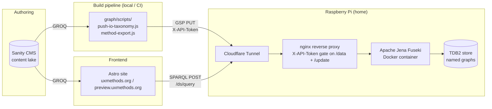

# UX Methods KG Infrastructure

This document describes the **production** deployment of the UX Methods knowledge graph: where Fuseki lives, how it's exposed, how authentication works, which datasets exist, and the operational backlog. For **local** development (Protégé, IRI conventions, named-graph strategy), see [README.md](README.md). For broader project context, see the root [CLAUDE.md](../CLAUDE.md).

## Topology



Public hostname: `fuseki.uxmethods.org` (Cloudflare Tunnel terminating to nginx on the Pi).

## Fuseki datasets

### `/ds` — active production dataset

This is the dataset queried by the Astro site and written to by the export scripts. Contains the SKOS IO taxonomy (in its named graph) and method relationship data.

**⚠️ Important: `/ds` was created via the Fuseki web UI, not via a hand-written config.** As a result:

- Fuseki auto-generated `ds.ttl` inside a Docker volume.
- The auto-generated config lives at `/var/lib/docker/volumes/jena-fuseki-inf_fuseki-config/_data/ds.ttl` on the Pi.
- The hand-maintained `config.ttl` in `/home/andy/jena-fuseki-inf/` **does not** define `/ds`.

This is why historically `/ds` worked while `/ds-owl` and `/ds-rdfs` existed but were empty: only `/ds` had data loaded. Promoting `/ds` into version-controlled config is on the cleanup backlog (see below).

### `/ds-owl` — experimental, currently empty

OWL inference dataset configured in the hand-written `config.ttl`. Uses `ja:reasonerURL <http://jena.hpl.hp.com/2003/OWLFBRuleReasoner>`. Backed by `/opt/fuseki/databases/owl`.

### `/ds-rdfs` — experimental, currently empty

RDFS inference dataset, also in `config.ttl`. Uses `ja:reasonerURL <http://jena.hpl.hp.com/2003/RDFSExptRuleReasoner>`. Backed by `/opt/fuseki/databases/rdfs`. Note that plain RDFS inference does **not** apply OWL property chains — for the upstream/downstream entailments defined in `uxmethods-core.ttl`, an OWL-capable regime is required.

## Endpoints

Live conventions on `/ds`:

| Endpoint        | Purpose                                  | Auth required        |
| --------------- | ---------------------------------------- | -------------------- |
| `/ds/query`     | SPARQL read (used by Astro at build time)| No                   |
| `/ds/update`    | SPARQL update                            | Yes (`X-API-Token`)  |
| `/ds/data`      | Graph Store Protocol (PUT/POST/DELETE)   | Yes (`X-API-Token`)  |

Astro currently POSTs to `https://fuseki.uxmethods.org/ds/query` (see `astro/src/pages/method/[slug].astro`). Earlier notes referred to `/ds/sparql`; the live convention is `/ds/query`. Standardizing endpoint naming is on the cleanup backlog.

## Named graphs and the default graph

The IO taxonomy is stored in the **named graph** `https://uxmethods.org/taxonomies/io` — the IRI intentionally matches the SKOS concept-scheme IRI.

The `/ds` dataset does **not** have `tdb2:unionDefaultGraph` enabled. Triples in named graphs are therefore **not** visible from the default graph, and queries that need taxonomy triples must wrap their patterns in `GRAPH <…> { … }`. See [ADR 0003](../docs/decisions/0003-explicit-graph-clauses.md) for the decision rationale.

## Authentication

**Read endpoints (`/ds/query`)** are unauthenticated.

**Write endpoints (`/ds/data`, `/ds/update`)** are gated at the nginx layer by a custom header:

```nginx
if ($http_x_api_token != "<token>") {
    return 403;
}
```

Clients must send:

```
X-API-Token: <token>
```

The `graph/scripts/push-io-taxonomy.js` script reads `FUSEKI_API_TOKEN` from the local environment and sends the header.

> **Historical note — Basic Auth.** Early setup attempted standard HTTP Basic Auth, which silently failed because nginx was not configured with `auth_basic`. The current `X-API-Token` scheme replaced that approach. If you see write requests returning 403 and your client is sending `Authorization: Basic …`, that's the trap — switch to `X-API-Token`.

## Graph Store Protocol (GSP)

GSP — the SPARQL 1.1 Graph Store HTTP Protocol — is used to replace named graphs wholesale by HTTP PUT. The `FUSEKI_GSP_ENDPOINT` environment variable points at `/ds/data` on the live server.

Live pattern used by `push-io-taxonomy.js`:

```
PUT https://fuseki.uxmethods.org/ds/data?graph=https://uxmethods.org/taxonomies/io
Content-Type: text/turtle
X-API-Token: <token>
```

A successful PUT replaces the entire named graph with the request body.

## URI policy

- **Taxonomy (SKOS):** hash URIs — `https://uxmethods.org/taxonomies/io#<conceptId>`
- **Ontology terms:** slash URIs — `https://uxmethods.org/ontologies/uxmethods-core#…` (see live ontology for current namespace; the legacy `…/ontology/…` namespace appears in some places and is part of the cleanup work)
- **Method instances:** slash URIs — `https://uxmethods.org/method/<Slug>`

The mixed hash/slash strategy is intentional. See [ADR 0002](../docs/decisions/0002-uri-policy-hash-vs-slash.md).

## RDF push pipeline

Stack used by the exporter scripts (`graph/scripts/`):

- `@sanity/client` — GROQ queries against Sanity
- `n3` — Turtle serialization
- `dotenv` — local config

The scripts support dry runs (`DRY_RUN=1`), writing Turtle to disk under `graph/build/`, and Graph Store Protocol PUTs to Fuseki. See [README.md](README.md) for invocation.

## Cleanup backlog

Tracked here so it stays visible. Items are ordered roughly by leverage, not urgency.

- [ ] **Promote `/ds` into version-controlled config.** Move dataset config out of the auto-generated `ds.ttl` (Docker volume) and into the hand-maintained `config.ttl` in `/home/andy/jena-fuseki-inf/`. Eliminates the "config invisible in Git" surprise.
- [ ] **Standardize endpoint naming.** Confirm `/ds/query` is the canonical read endpoint and update any drifted references (older notes mention `/ds/sparql`).
- [ ] **Decide `unionDefaultGraph`.** Current stance: keep `false`, require explicit `GRAPH` clauses (see [ADR 0003](../docs/decisions/0003-explicit-graph-clauses.md)). Revisit when query ergonomics start to bite.
- [ ] **Decide the fate of `/ds-owl` and `/ds-rdfs`.** Both are empty today. Options: keep for future inference experiments, remove to simplify, or rebuild later when needed. Default for now: leave alone unless Pi resources get tight.
- [ ] **Harden the security model.** Static shared token in nginx works but is coarse. Candidates: nginx Basic Auth, Cloudflare Access, a dedicated admin hostname, or a per-purpose service token (e.g. a GitHub Actions token separate from local pushes).
- [ ] **Align predicate vocabularies between Astro and the exporter.** The live Astro page queries `uxmo:hasInput`/`uxmo:hasOutput` from `https://uxmethods.org/ontology/`, while the current ontology and exporter use `uxm:usesInput`/`uxm:producesOutput` from `https://uxmethods.org/ontologies/uxmethods-core#`. Either the Astro query needs migrating, or the data currently in Fuseki was loaded by an older exporter.
- [ ] **Scope Astro's KG query.** The query in `astro/src/pages/method/[slug].astro` currently computes all method-to-method relationships globally and filters client-side. There's a `TODO` to narrow it to the current method.
- [ ] **Pick a production inference strategy.** Open decision between Fuseki query-time inference and a materialized derived graph — see [ADR 0004](../docs/decisions/0004-production-inference-strategy.md).
